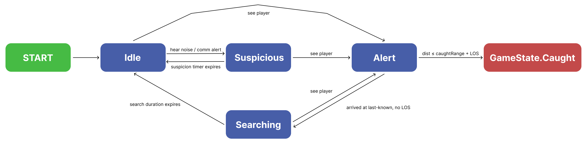
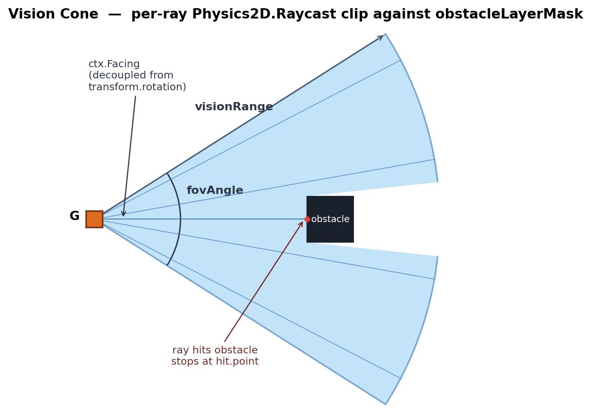

# Stealth AI Sandbox

**Ariverse Studio Game Programmer Intern Test 2026**

---

### Build

Built with Unity 6000.3.10f1, Windows x64 Standalone.

Build settings: `MainMenu.unity` (slot 0) → `Gameplay.unity` (slot 1).

`.exe` build link: https://drive.google.com/file/d/1wMeZfUVlQ9ItTTjZfehw7oP8MtfDnxsG/view?usp=sharing

---

### Assets Used

1. https://freesound.org/people/Reg1n0ld/sounds/508714/
2. https://freesound.org/people/Warped_Tension/sounds/583733/
3. https://freesound.org/people/davdud101/sounds/150505/
4. https://freesound.org/people/Awesopossumm/sounds/786063/
5. https://murphysdad.itch.io/sci-fi-facility
6. https://liminal-space-dev.itch.io/free-horror-sfx-sounds

---

## Game Information

### Controls

| Action | Key |
|---|---|
| Move | WASD / Arrow Keys |
| Crouch (hold) | Left Ctrl |
| Sprint (hold) | Left Shift |

### UI Navigation

#### Main Menu (`MainMenu.unity`, build index 0)

The first scene loaded by the build.

- **Play** button: loads `Gameplay.unity`.
- **Quit** button: closes the application (no effect inside the Editor).

#### In-Game HUD (`Gameplay.unity`)

- **Noise meter** (top-left): a blue horizontal fill bar that visualises the player's current noise level while moving. The bar's fill amount equals `stance.noiseIntensity`:

  | Stance | Bar fill | Heard by guards within |
  |---|---|---|
  | Crouch (Ctrl held) | empty (0%) | never |
  | Walk (default) | half (50%) | `hearingRadius × 0.5` |
  | Sprint (Shift held) | full (100%) | `hearingRadius × 1.0` |

  The bar drains to 0 when the player is standing still, regardless of stance. The bar's source sprite is generated at runtime in `HUD.Awake`.

#### Game Over screen

Appears with a fade-in after a guard catches you. The simulation is paused (`Time.timeScale = 0`).

- **Retry** button: reloads `Gameplay.unity` (resets all guards, route progress, the noise meter, and the timescale).
- **Main Menu** button: returns to `MainMenu.unity`.

#### Win screen

Appears with a fade-in when the player reaches the objective zone. The simulation is paused.

- **Main Menu** button: returns to `MainMenu.unity`.
- **Quit** button: closes the application.

All buttons are Unity UI buttons hit by mouse click. They fire regardless of `Time.timeScale`, so the pause does not block UI interaction.

### Win Condition
Reach the **objective zone** (glowing portal) without being caught.

### Lose Condition
A guard spots you while in **Alert** state and closes within `caughtRange` (~0.75 tile) → instant Game Over.
Both Win and Game Over screens fade in and pause the game. Retry or return to Main Menu via the on-screen buttons.

### Implemented Features

- [x] Top-down 2D player movement with 3 stances:
  - **Crouch** (silent, 0.6× speed, hold to activate)
  - **Walk** (medium noise, 1.0× base speed)
  - **Sprint** (loud, 1.5× speed, hold to activate)
- [x] **2 configurable guard NPCs** with Loop / PingPong patrol routes and **per-waypoint wait times** authored in the scene
- [x] **Mesh-based dynamic vision cone** that clips on obstacles in real time, with smooth tunable rotation (`rotationSpeed` 540°/s by default)
- [x] **Guard FSM: Idle → Suspicious → Alert → Searching** (class-per-state polymorphism, zero nested if-else)
- [x] **Last-known position pursuit**: Alert guards navigate via NavMesh to where the player was last *seen*, never teleport
- [x] **Hearing radius**: guards react to footstep noise scaled by stance (crouch silent, walk 0.5×, sprint 1.0×)
- [x] **Inter-guard communication**: alerting guard broadcasts via SO event channel. Nearby guards (Euclidean radius trigger) react and pathfind to the alerter's last-known-player position
- [x] **2D NavMesh pathfinding** via [NavMeshPlus (h8man)](https://github.com/h8man/NavMeshPlus): guards route around walls instead of getting stuck
- [x] **Two-phase Suspicious state**: always travels to the suspicion point first, *then* looks around for `suspicionDuration`
- [x] **Win / Lose UI** with CanvasGroup fade-in and game pause. Retry reloads the gameplay scene cleanly
- [x] **Audio**: 8 distinct `SoundCueSO` assets, round-robin SFX pool with steal-oldest, dynamic calm-tense music crossfade tied to the alert count
- [x] **Polish**: camera shake on detection, hit-stop on caught, "!" / "?" exclamation prefabs parented to the guard so they follow during pursuit and despawn after 1.5 s
- [x] **AnimationDriver2D**: directional sprite animations (Idle / MoveUp / MoveDown / MoveLeft / MoveRight) driven by velocity, independent of transform rotation
- [x] **Editor tooling**: `PatrolRouteEditor` (drag handles, Shift+Click to append, per-waypoint wait time, scene labels), `GuardProfileEditor` (grouped sliders re-clamped for this map's scale), `UIBuilder` (`Stealth → Build Scene UI` menu)
- [x] **Live debug logs** on every guard state transition and inter-guard alert: easy to demo to a reviewer with the Console window open

### Unimplemented Features

- **Difficulty Scaling**: Easy / Default / Hard `GuardProfile` values are designed but the selector script + MainMenu UI for picking difficulty did not ship. Reason: deprioritised in favour of polishing the core FSM, NavMesh setup, and the inter-guard communication mechanism.
- **Save System**: no persistent state across runs. Reason: out of scope for a single-level prototyp. There is no high score, level progress, or settings to persist.
- **Mobile Support**: build target is Windows x64 Standalone only. Touch input and responsive UI scaling were not implemented. Reason: This is a plus point requirement, so it was not prioritised.
- **VFX / Shader**: no custom shaders. The FOV mesh uses URP's default unlit material with state-tinted colour swaps. No fog-of-war or stylised post. Reason: art quality is explicitly not a focus as written in the PDF, so time was spent on systems instead.

## Technical Test Compliance Checklist

| PDF Requirement | Status | Implementation Evidence |
|---|---|---|
| Core a: Top-down movement + crouch/sneak modifier | ✅ Done | `PlayerController` + 3× `PlayerStanceSO`; New Input System actions |
| Core b: ≥2 guards + configurable patrol routes | ✅ Done | 2× `Guard.prefab` instances in `Gameplay.unity`; per-route `PatrolRoute` SO with per-waypoint wait time |
| Core c: Vision cone + occlusion | ✅ Done | `GuardVision` (FOV angle + range + Physics2D.Raycast) + `FieldOfViewMesh` (real-time clipped triangle fan) |
| Core d: Explicit guard FSM | ✅ Done | `IGuardState` interface; one class per state (`IdleState`, `SuspiciousState`, `AlertState`, `SearchingState`); `Machine.ChangeState(...)` transitions with early `return`; no nesting |
| Core e (optional): Hearing radius | ✅ Done | `NoiseEventChannelSO` + `PlayerNoiseEmitter` + `GuardHearing` |
| Core f (optional): Inter-guard communication | ✅ Done | `AlertEventChannelSO`; radius-filtered Euclidean trigger; NavMesh navigation to alerter's last-known-player position |
| Core g: Last-known position | ✅ Done | `AlertState` uses `NavMeshAgent.SetDestination(LastKnownPlayerPos)`; SuspiciousState two-phase travel guarantees arrival |
| Core h: Win + Lose | ✅ Done | `ObjectiveZone` win trigger + AlertState caught check + `GameManager` fade screens with `Time.timeScale = 0` pause |

---

## Architecture

### Guard State Machine



**States** (one C# class per state, all implementing `IGuardState`):

- `IdleState`: default. Patrols its assigned `PatrolRoute` if any, otherwise stands.
- `SuspiciousState`: two-phase. First travels to the suspicion point via NavMesh (with a `2.5 x suspicionDuration` safety cap), then looks around in place for `suspicionDuration` before returning to Idle.
- `AlertState`: active pursuit. Navigates to `LastKnownPlayerPos` via NavMesh. Raises an alert broadcast on Enter/Exit and triggers `GameState.Caught` when `distance <= caughtRange` with Line of Sight (LOS).
- `SearchingState`: post-Alert wander within `searchWanderRadius` of the last-known position for `searchDuration` seconds, with each wander target snapped to the NavMesh via `NavMesh.SamplePosition`.

**Transitions** (each is a single `Machine.ChangeState(new XxxState())` call with an early `return`, no nested if/else):

| From | Trigger | To |
|---|---|---|
| Idle | hear noise / receive comm alert | Suspicious |
| Idle | see player | Alert |
| Suspicious | see player | Alert |
| Suspicious | look-around timer expires (after arrival) | Idle |
| Suspicious | travel time exceeds `2.5 x suspicionDuration` | Idle |
| Alert | `distance <= caughtRange` with LOS | `GameState.Caught` (terminal) |
| Alert | arrive at last-known position, no LOS | Searching |
| Alert | `LastKnownPlayerPos` becomes null | Idle |
| Searching | see player | Alert |
| Searching | `searchDuration` expires | Idle |

**Key design**: every state is a separate C# class implementing `IGuardState.Enter / Tick / Exit`. Adding a new state = new class + one `ChangeState(new NewState())` call; existing states are untouched. Every transition logs to the Console with the guard's short ID (`[Guard a1b2] IdleState -> SuspiciousState`), handy for live demos. Log calls are wrapped in `#if UNITY_EDITOR` so they don't reach Player.log in shipped builds.

### Vision Cone



Detection logic uses `ctx.Facing` (unit Vector2, smoothly rotated toward the agent's velocity at `rotationSpeed` °/s). The FOV mesh and `GuardVision.CheckVision()` both read this facing. The guard's transform itself never rotates, so directional sprite animations can play without conflict.

#### Detection algorithm

`GuardVision.CheckVision()` runs every `Update` and returns whether the player is currently visible. Three sequential gates, any failure short-circuits the rest so far-away players cost almost nothing:

```csharp
private bool CheckVision()
{
    if (_playerTransform == null || _profile == null) return false;

    Vector2 origin = transform.position;
    Vector2 toPlayer = (Vector2)_playerTransform.position - origin;
    float dist = toPlayer.magnitude;

    if (dist > _profile.visionRange) return false;                                // Gate 1

    float angle = Vector2.Angle(FacingDirection, toPlayer);
    if (angle > _profile.fovAngle * 0.5f) return false;                           // Gate 2

    RaycastHit2D hit = Physics2D.Raycast(origin, toPlayer.normalized,
                                         dist, _profile.obstacleLayerMask);      // Gate 3
    return hit.collider == null;
}
```

From [GuardVision.cs:38](Assets/Scripts/Guard/Perception/GuardVision.cs#L38).

**Gate 1 (distance)** is cheap arithmetic, a magnitude compare. Done first so a far located player costs nothing further.

**Gate 2 (angle)** computes the angle between `FacingDirection` (the smoothly-rotated `ctx.Facing` Vector2) and the direction to the player. Half the FOV on each side of the facing vector defines the cone: at `fovAngle = 60°`, anything more than 30° off-axis is a blind spot. This is purely vector math, no physics.

**Gate 3 (line of sight)** is the only physics call. A single `Physics2D.Raycast` fires from the guard directly to the player. If anything on `obstacleLayerMask` (the wall tilemap) intersects that line, the player is occluded.

#### Why only one raycast in Gate 3

The visual `FieldOfViewMesh` casts `coneResolution` (60) rays per frame to build its triangle fan, those rays sweep across the cone angle because the mesh doesn't know where to draw the cone edges until it samples wall positions. Detection is different: by the time Gate 3 runs, Gates 1 and 2 have already confirmed the player is within range and within the cone. The only remaining question is "is the direct line between the guard and the player blocked?" which is a single point-to-point ray. Detection is completely independent of the mesh.

#### Recording the last-seen position

```csharp
private void Update()
{
    CanSeePlayer = CheckVision();
    if (CanSeePlayer)
        LastSeenPosition = _playerTransform.position;
}
```

`LastSeenPosition` captures the player's world position at the moment of visibility. When `AlertState.Enter` runs, this value becomes `ctx.LastKnownPlayerPos`, which is what the NavMesh agent is told to navigate to. Even after the player breaks line of sight and disappears around a corner, the guard keeps moving toward that last-seen position. It never teleports to the player's current position.

### Hearing

| Stance | Noise intensity | Effective radius |
|---|---|---|
| Crouch | 0.0 (silent) | 0 wu (never heard) |
| Walk | 0.5 | `hearingRadius × 0.5` (~0.275 wu) |
| Sprint | 1.0 | `hearingRadius × 1.0` (~0.55 wu) |

A `NoiseEventChannelSO` (ScriptableObject) connects emitter and listeners: `PlayerNoiseEmitter` raises events, `GuardHearing` subscribes in `Initialize` and unsubscribes in `OnDestroy`. Zero direct coupling between player and guards.

#### Emitter side: PlayerNoiseEmitter

```csharp
private void FixedUpdate()
{
    if (_player.MoveInput.sqrMagnitude < 0.01f) return;

    var stance = _player.CurrentStance;
    if (stance == null || stance.noiseIntensity <= 0f) return;

    _footstepTimer -= Time.fixedDeltaTime;
    if (_footstepTimer > 0f) return;

    _footstepTimer = stance.footstepInterval;

    noiseChannel?.Raise(new NoiseEventData
    {
        Position  = transform.position,
        Intensity = stance.noiseIntensity
    });
    // ... footstep SFX
}
```

From [PlayerNoiseEmitter.cs:20](Assets/Scripts/Player/PlayerNoiseEmitter.cs#L20).

Two early-exits gate the entire block. **Standing still is silent**: `MoveInput.sqrMagnitude < 0.01f` skips the timer entirely, a stationary player emits no footstep events at all regardless of stance. **Crouch is silent**: `stance.noiseIntensity <= 0f` (Crouch's value is exactly 0) skips the block before the timer ever ticks.

Cadence is per-stance via `stance.footstepInterval`: walk = 0.40 s (~2.5 footsteps/s), sprint = 0.22 s (~4.5 footsteps/s). Sprint is heard more often AND at a larger radius.

#### Listener side: GuardHearing

```csharp
private void OnNoiseRaised(NoiseEventData data)
{
    if (_ctx == null) return;
    float effectiveRadius = _ctx.Profile.hearingRadius * data.Intensity;
    if (Vector2.Distance(transform.position, data.Position) <= effectiveRadius)
    {
        _ctx.HeardNoise = true;
        _ctx.LastHeardNoisePosition = data.Position;
    }
}
```

From [GuardHearing.cs:30](Assets/Scripts/Guard/Perception/GuardHearing.cs#L30).

The linear scaling `effectiveRadius = hearingRadius × intensity` produces the per-stance behaviour automatically, with no special cases:
- **Crouch** (intensity 0.0): effective radius is 0 wu. `Vector2.Distance(...) <= 0` is only true if the player is exactly on top of the guard, which physical collisions prevent. Crouching footsteps are inaudible regardless of distance.
- **Walk** (intensity 0.5): effective radius is half of `profile.hearingRadius`. At the current value of 0.55 wu, walk is audible within ~0.275 wu (~1.7 tiles).
- **Sprint** (intensity 1.0): effective radius is the full `profile.hearingRadius`, sprint is audible at maximum range (~0.55 wu, ~3.4 tiles).

Crouch silence isn't a special branch in code, it falls out of the multiplication.

#### State machine consumption

When `HeardNoise` is set, nothing happens immediately, the listener just updates context flags. On the next frame, `IdleState.Tick` checks the flag, transitions to `SuspiciousState`, and copies `LastHeardNoisePosition` into `ctx.SuspicionPoint`. `SuspiciousState` then NavMesh-routes the guard to that point.

Because the channel is a ScriptableObject, the emitter and listener never reference each other. Future noise sources can raise the same channel with no changes to guard code.

### Inter-Guard Communication

Guards **never hold direct references to each other**. All coordination flows through `AlertEventChannelSO`, a ScriptableObject event channel. Each guard generates a unique `GuardId` (Guid) in `Awake` so self-broadcasts can be filtered out.

#### Broadcast: AlertState.Enter

```csharp
public void Enter(GuardContext ctx)
{
    // ... SFX, exclamation, FOV colour
    ctx.AlertChannel?.Raise(new AlertEventData
    {
        AlerterGuid        = ctx.GuardId,
        AlerterPosition    = ctx.Tr.position,
        LastKnownPlayerPos = ctx.LastKnownPlayerPos ?? (Vector2)ctx.Tr.position,
        IsStarting         = true
    });
}
```

From [AlertState.cs:13](Assets/Scripts/Guard/StateMachine/States/AlertState.cs#L13).

`LastKnownPlayerPos` is what the alerter *itself* saw, the vision-cone hit position that triggered the Alert transition. Listening guards adopt this value as their own suspicion target, so they investigate where the player actually was, not the broadcaster's location.

The same channel fires on `Exit` with `IsStarting = false`. That signal lets `MusicDirector` track how many guards are simultaneously alerted and crossfade between calm and tense music; listeners ignore Exit events for state-transition purposes.

#### Listen: GuardController.OnAlertReceived

```csharp
private void OnAlertReceived(AlertEventData data)
{
    if (data.AlerterGuid == _ctx.GuardId) return;       // 1. self filter
    if (!data.IsStarting) return;                       // 2. start-only

    float dist = Vector2.Distance(transform.position, data.AlerterPosition);
    // ... diagnostic log

    if (dist > profile.communicationRadius) return;     // 3. radius filter

    if (_stateMachine.Current is AlertState ||          // 4. busy filter
        _stateMachine.Current is SearchingState) return;

    _ctx.ReceivedCommunicationAlert = true;
    _ctx.CommunicationKnownPosition = data.LastKnownPlayerPos;
}
```

From [GuardController.cs:124](Assets/Scripts/Guard/GuardController.cs#L124).

The four filters in order:

1. **Self filter** (`AlerterGuid == _ctx.GuardId`): the alerter receives its own broadcast because the channel fans out to all subscribers. A GUID equality check drops it. The GUID is generated once per guard in `Awake` via `Guid.NewGuid()`.
2. **Start-only** (`!data.IsStarting`): only Alert-Enter events wake listeners. Alert-Exit events flow through the same channel for the music director but must not trigger reactions.
3. **Radius filter** (Euclidean): pure `Vector2.Distance` against `profile.communicationRadius`. The trigger is a radius, wall-blocking is intentionally not checked at this stage. The receiver still navigates around walls, but it's triggered by raw proximity.
4. **Busy filter**: guards already in Alert or Searching are pursuing the player themselves; comms shouldn't reset their navigation target.

If all four pass, the receiver sets `ReceivedCommunicationAlert = true` and stores `CommunicationKnownPosition = data.LastKnownPlayerPos`.

#### Reaction: IdleState consumes the flag

On the next `IdleState.Tick`, the flag is consumed: the guard transitions to `SuspiciousState` with `SuspicionPoint = CommunicationKnownPosition`. `SuspiciousState.Tick` then calls `ctx.Agent.SetDestination(SuspicionPoint.Value)` and the NavMesh agent pathfinds to that position, routing naturally around walls.

This is a two-stage architecture: Euclidean radius for triggering, NavMesh for navigation.

### NavMesh

2D pathfinding uses [NavMeshPlus by h8man](https://github.com/h8man/NavMeshPlus), a fork of Unity NavMeshComponents with native 2D extensions. The `NavMeshSurface` GameObject in `Gameplay.unity` is rotated `(-90, 0, 0)` (the standard 2D NavMesh trick) with a `CollectSources2d` extension component that picks up tilemap colliders. A custom **GuardAgent** type is defined under `Edit → Project Settings → AI → AI Navigation → Agents` (radius 0.04, height 0.16, slope 0, climb 0.04, minRegionArea 0). The agent type is matched on the `NavMeshAgent` component of `Guard.prefab`.

After editing the tilemaps, re-bake by selecting the `NavMeshSurface` GameObject and clicking **Bake** in the inspector.

---

## Reflection

### Known Bugs / Limitations

- **Manual NavMesh re-bake**: any tilemap edit requires clicking Bake on the NavMeshSurface again. There's no runtime/automatic re-bake.
- **Caught range is center-to-center**: no pixel-perfect hitbox. By design, keeps the catch math simple.
- **Hearing is event-based, not cumulative**: a guard doesn't accumulate suspicion from sustained noise. Each footstep is a discrete event that re-triggers Suspicious if heard.
- **Mesh cone performance**: each guard casts ~60 rays/frame. Tested with 2 guards at 60 fps. For many guards (10+), drop `coneResolution` in `GuardProfile` to 30.

### What I Would Improve With More Time

- **Difficulty modes**: Easy / Default / Hard.
- **Distraction items**: a throwable that raises a `NoiseEventChannelSO` event at the impact point to lure guards away.
- **Interactable objects**: an interactable object that raises a `NoiseEventChannelSO` event at the interact key press.
- **Persistent settings**: volume slider + difficulty pick persisted to `PlayerPrefs`.
- **Automated NavMesh re-bake**: `OnValidate` hook or a tilemap-changed callback that calls `NavMeshSurface.BuildNavMeshAsync()` at edit-time.

### Biggest Challenges

1. **2D NavMesh setup**. Unity's official AI Navigation package is technically capable of 2D but the `(-90, 0, 0)` rotation workaround plus the default `Humanoid` agent (1 wu diameter) produced empty bakes on this small map. Switching to NavMeshPlus (h8man) and defining a custom `GuardAgent` type with `radius = 0.04` was the unlock that made narrow corridors traversable.
2. **Decoupling facing from transform rotation**. A naive implementation rotated the guard's transform to face the movement direction, which conflicted with the directional sprite clips (`MoveLeft`/`MoveRight`/…). The fix: store `ctx.Facing` as a `Vector2` on `GuardContext`, smoothly update it via `Mathf.MoveTowardsAngle`, and read it in `FieldOfViewMesh.BuildMesh` + `GuardVision.CheckVision`. The transform stays unrotated; the FOV cone and detection both still track heading.
3. **Rescaling to a tiny world**. The original tunables assumed 1 wu = 1 m, but the project uses a 0.16-wu tilemap cell with an orthographic camera size of 1. Every default vision range / hearing radius / speed value was an order of magnitude too large. Each value in `GuardProfile` and `PlayerStanceSO` was rebalanced from that scale, with the `GuardProfileEditor` slider clamps re-tightened to small-scale-friendly ranges.

---

## AI Tools Used

- **Claude Code**: used for architecture planning and initial code scaffolding. "All code was reviewed, and some was adjusted. Scene setup, asset wiring, level design, NavMesh setup, animator controllers, animation clips, and integration testing were done manually.
